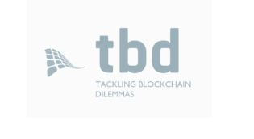

# Repo of Team TBD
...tackling blockchain dilemmas...

## Requirements:
https://docs.google.com/spreadsheets/d/1LCiIXgi5h1v5nsZqfzUiQbFVnukMZWMOC-svTEgiKvA/edit?usp=sharing

## Slides:
https://docs.google.com/presentation/d/1QzDG_8U8dBr2C6yyaqbmQecZeRXTv7T0gejqYn9PS6c/edit?usp=sharing

## Achievements (from the specs):
### REQUIREMENTS:
- [x] MUST use an ERC-20 compatible token for your STO
- [x] MUST be able to perform forced transfers for legal actions
- [x] MUST use an on-chain whitelist for investors
- [x] MUST enable to mint/burn tokens
- [x] MUST offer an on-chain solution to purchase (and sell back) tokens
- [x] MUST allow the possibility to be executed only through a specific interface (no implementation required)

### BONUS:
- [x] Attach the prospectus document as a .pdf to the token contract

### LIMITS:
- [x] (OFFCHAIN) Only investors from Germany are allowed to invest (KYC)
- [x] You are not allowed to raise more than 50,000,000 € (= 50,000,000 token)
- [x] Minimal buy-in is 1000 tokens (only relevant for initial buy)

### INVESTORS:
- [x] There are 200 investors. Each of them wants to purchase 1000 tokens. The investors will use ETH (or a stablecoin) to purchase your token. All of this should work on-chain (you are allowed to use oracles).
- [x] Once you bougt your tokens you have 14 days for a withdrawal. An investor decides to return his/her token after 2 days of keeping them. (Rest to be completed.)
- [x] An investor wants to sell 50% of its token to a new investor that is not a token holder yet.
- [x] An investor wants to sell 20% of its stack to another investor that is a token holder.
- [x] An investor was forced to initiate a transaction. Burn the old tokens and mint new ones for the new address. Revert (this can be a mint/burn or a transfer) all transactions (hint: all deadlines stay the same (e.g. payout for interests)).
- [x] A token holder has to pay all of his tokens to another investor (court order), but s/he resists/can't to sign the transaction. Enforce the transaction.
- [x] An investor duly terminates the term and tries to sell his/her tokens after that to another token holder.
- [x] An investor wants to buy more tokens than the maximal limit.
- [x] An investor wants to buy only 500 tokens but must buy at least 1000 tokens.
- [x] An Investor tries to sell tokens but is not allowed to do so before holding it X days (these days should be a variable that you can update). Asset freezing.

### ISSUER:
- [x] The issuer mints/burns tokens based on the investments.

### MISC:
- [x] Extraordinary termination. Your company must face insolvency. Make a public announcement on the blockchain. (Could be also something else the main point is to do public signaling. This could be used for different cases.)